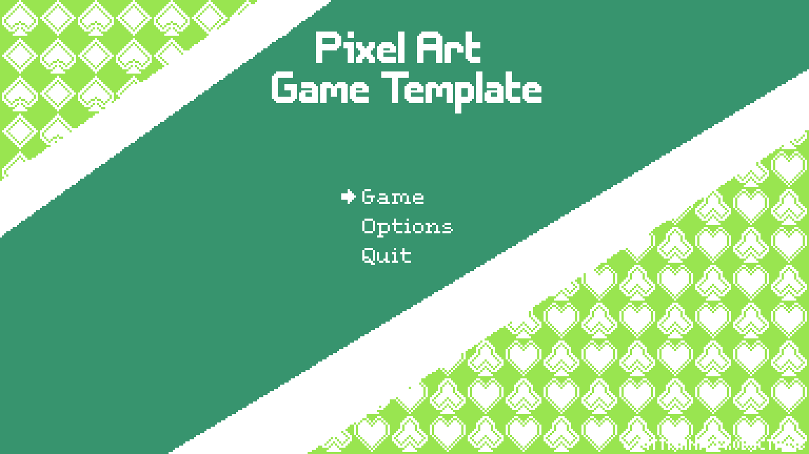

# Godot Pixel Art Template
A Pixel Art Template for projects with godot 4.x

## Content
### MainMenu & Placeholder
A simple Main Menu and Placeholder Scene for quick start into prototyping that can also easily be alterted.  
The Main Menu has three buttons: Game, Options and Quit, where the first two load the Placeholder 
Scene and the last quits the applications.  
The Placeholder Scene has a back button, that by default goes back to the Main Menu, however any 
scene can be specified in the exported variable  

### Engine Presets
This includes the following editor settings:
- for non-blurry asset imports: *General > Rendering > Textures > Canvas Textures > Default Texture Filter = Nearest*
- for pixel snapping: *General > Rendering > 2D > Snap > Snap 2D Transforms to Pixel*
- for pixel snapping: *General > Rendering > 2D > Snap > Snap 2D Vertices to Pixel*
- show pixel grid in 2D: Toggle Grid Snapping (Shift + G) and configure snapping options (three dots symbol to the right) 
- snap to pixel grid in 2D: Toggle Smart Snapping (Shift + S)

### Functionality Modules
An `autoload` for global variables (path to scenes, ...) and `utility` functions (changing scenes safely, ...)  

### Examples
In `examples` there are some pre-built example games to show some of the functionality in an in-game experience.

### In game jams
Entry for the Game Off 2022: [Gnop](https://glennorous.itch.io/gnop).

## Credits

### Fonts
This repository uses the free, basic pixel art fonts made available from Pixel Overload. Feel free to check out Pixel Overloads full package,
that contains some really cool desings.  
Also make sure, when importing new fonts to set `Antialiasing` to `None`.
